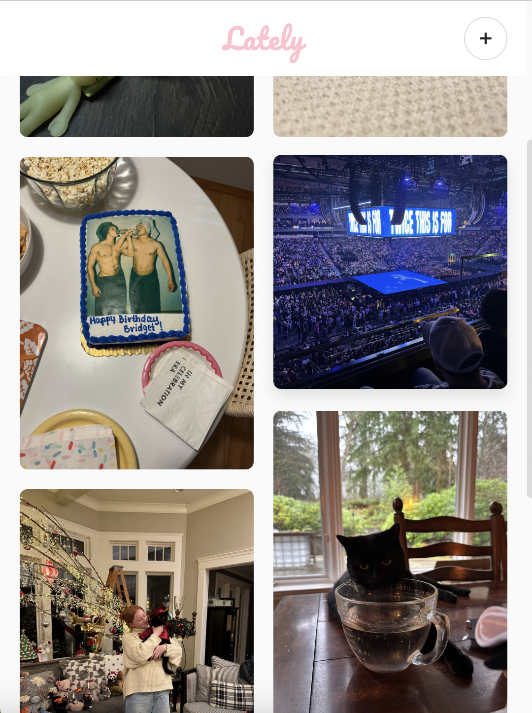

# Lately - Serverless Photo Feed App

A lightweight, Instagram-inspired photo sharing application built to learn AWS cloud services and serverless architecture. This project gave me hands-on experience with the core AWS services used in web applications.

**Website:** [avaraper.com](https://lately.avaraper.com)



## Project Goals

I wanted a personal photo journal I could share with friends and family without using Instagram or other social media platforms. This was also my opportunity to learn AWS by building something practical instead of just following tutorials. I wanted to understand:

- How different AWS services work together in real applications
- The serverless deployment model
- Managing cloud storage and databases
- Working with AWS IAM for access control
- The cost and scalability benefits of cloud infrastructure

## What I Built

**Lately** is a personal photo journal with public viewing—like a combination of Pinterest and a private Instagram. Deployed at **[avaraper.com](https://avaraper.com)** using AWS CloudFront and a custom SSL certificate.

**The concept:**
- **I'm the only one who can upload photos** (password-protected admin access)
- **Anyone can view, like, and comment** (anonymous public access)
- **Only I can delete content** (photos and comments require password)

Think of it as a shareable photo diary where friends and family can see what I'm up to, react, and leave comments. n

**Features:**
- Password-protected uploads and deletions (admin-only)
- Anonymous likes and comments (no user accounts needed)
- Like persistence (can't spam likes on the same post)
- Automatic archiving (keeps only the 20 most recent posts visible)
- Responsive masonry grid layout
- Mobile-friendly with swipe gestures
- Custom domain with HTTPS (CloudFront + SSL certificate)

## AWS Services Used

### **Amazon S3 (Simple Storage Service)**
**What it does:** Cloud storage for files

**How I used it:**
- Created a bucket to store all uploaded photos and host the frontend
- Configured public read access so images can be displayed
- Organized photos in a `/photos/` folder with unique IDs
- Frontend files (index.html, app.js, styles.css) stored in bucket root
- Each photo gets a permanent URL: `https://bucket-name.s3.amazonaws.com/photos/{id}.jpg`

**What I learned:**
- How to create and configure S3 buckets
- The difference between bucket-level and object-level permissions
- How to structure S3 storage for web applications
- Using S3 for both file storage and static website hosting

---

### **Amazon CloudFront**
**What it does:** Content Delivery Network (CDN) that caches content globally for faster access

**How I used it:**
- Created a CloudFront distribution pointing to my S3 bucket
- Connected my custom domain (avaraper.com) to the CloudFront distribution
- Added a custom SSL certificate for HTTPS (secure connections)
- CloudFront serves my frontend files and caches them at edge locations worldwide

**What I learned:**
- How CDNs improve website performance by caching content closer to users
- How to set up custom domains with CloudFront distributions
- SSL/TLS certificate management with AWS Certificate Manager
- The difference between serving from S3 directly vs. through CloudFront
- Why CloudFront is important for production websites (speed, security, custom domains)

---

### **Amazon Route 53**
**What it does:** DNS (Domain Name System) service that routes users to your application

**How I used it:**
- Registered and managed the domain avaraper.com
- Created DNS records (A record and AAAA record) pointing to CloudFront
- Configured DNS to route traffic from my custom domain to the CloudFront distribution

**What I learned:**
- How DNS works (translating domain names to IP addresses)
- Different types of DNS records (A, AAAA, CNAME, NS, SOA)
- How to connect custom domains to AWS services
- Why you need both Route 53 and CloudFront for custom domains

---

### **AWS Lambda**
**What it does:** Run code without managing servers (serverless functions)

**How I used it:**
I created 6 Lambda functions, each handling a specific task:

1. **UploadPhoto** - Processes image uploads, saves to S3, stores metadata in DynamoDB
2. **GetFeed** - Retrieves all posts with their likes and comments
3. **AddLike** - Records likes and prevents duplicates
4. **AddComment** - Adds comments to posts
5. **DeletePhoto** - Removes photos and all associated data
6. **DeleteComment** - Deletes specific comments

**What I learned:**
- How to write Lambda functions in Python
- Event-driven architecture (functions only run when called)
- Lambda function URLs for creating HTTP endpoints
- How to package dependencies for Lambda deployment
- Managing function permissions and timeouts
- The cost benefits of serverless (only pay when functions execute)

---

### **Amazon DynamoDB**
**What it does:** Fast, flexible NoSQL database

**How I used it:**
- Single table called `PhotoFeed` storing all data
- Used composite keys (PK + SK) for flexible querying
- Stored posts, likes, and comments with different key patterns:
  - `POST#{id} | META#{timestamp}` → Post data
  - `POST#{id} | LIKE#{user}#{date}` → Likes
  - `POST#{id} | COMMENT#{timestamp}#{id}` → Comments

**What I learned:**
- NoSQL data modeling (very different from SQL databases)
- How partition keys and sort keys work together
- Querying patterns in DynamoDB (Query vs. Scan)
- Why single-table design is common in DynamoDB
- How to prevent duplicate entries using conditional writes
- The performance benefits of DynamoDB for web applications

---

### **AWS IAM (Identity and Access Management)**
**What it does:** Controls who/what can access AWS resources

**How I used it:**
- Created an IAM user (`lately-admin`) with AdministratorAccess for managing AWS resources
- Generated Access Key ID + Secret Access Key for programmatic access (AWS CLI)
- Created one IAM role for the S3 bucket with appropriate permissions
- Lambda functions use execution roles to access S3 and DynamoDB

**What I learned:**
- The difference between IAM users (for people) and IAM roles (for services)
- How to use AWS CLI with access keys for deployment
- Why you need different credentials for different use cases
- How Lambda execution roles grant functions permission to access other AWS services
- The importance of never committing AWS credentials to GitHub

---

### **Lambda Function URLs**
**What it does:** Provides direct HTTPS endpoints for Lambda functions

**How I used it:**
- Created public URLs for each Lambda function
- Configured CORS to allow browser requests from my frontend
- No API Gateway needed (simpler for learning)

**What I learned:**
- The difference between Function URLs and API Gateway
- How to configure CORS for cross-origin requests
- When to use Function URLs vs. API Gateway

## Technical Implementation Details

### Image Handling
- Client-side compression before upload (reduces file size)
- Base64 encoding for transmission (Lambda accepts JSON, not multipart uploads)
- Maximum 5MB per image (Lambda payload limit is 6MB)
- Stored as `.jpg` files in S3

### Data Structure (DynamoDB)
Used single-table design with creative key naming:
```
PK              | SK                        | Data
----------------+---------------------------+------------------
POST#abc123     | META#2025-02-03T14:30:00  | {caption, imageUrl, timestamp}
POST#abc123     | LIKE#User456#2025-02-03   | {username, timestamp}
POST#abc123     | COMMENT#2025-02-03#xyz789 | {text, username, timestamp}
```

This allows:
- Get all data for a post: `Query where PK = POST#abc123`
- Get only likes: `Query where PK = POST#abc123 AND SK begins_with LIKE#`
- Count comments: `Query where PK = POST#abc123 AND SK begins_with COMMENT#`

### Frontend Features
- Vanilla JavaScript (no framework - kept it simple)
- Masonry grid layout that adapts to different screen sizes
- Swipe gestures for mobile (swipe down to close modals)
- LocalStorage for tracking which posts you've liked
- Real-time UI updates after likes/comments

### Password Protection Implementation
**How admin access works:**
- When I click "Upload" or "Delete", browser prompts for password
- Password is sent with the request to Lambda function
- Lambda function has the password hardcoded (validates before executing)
- If password matches: action proceeds
- If password wrong: returns 403 Forbidden error

**Why hardcode in Lambda?**
- No user accounts needed (just me as admin)
- Simple implementation for a personal project
- Password only exists server-side (not in frontend code)
- In production, would use AWS Secrets Manager instead

This gives me full control while allowing anonymous public interaction (likes/comments).

## What I Learned

### About AWS
- **Serverless is fundamentally different** - No servers to manage, just functions that run on-demand
- **AWS services integrate seamlessly** - Lambda, S3, DynamoDB, CloudFront, Route 53 all work together
- **CDNs matter for production** - CloudFront caching makes the site fast globally and enables custom domains
- **DNS is more complex than it seems** - Route 53 records, SSL certificates, and CloudFront all need to be configured correctly
- **Pay-per-use is powerful** - Only charged when functions run (not 24/7 like traditional servers)
- **IAM is critical** - Everything in AWS requires proper permissions
- **Cold starts are real** - First Lambda invocation after idle time is slower
- **Deployment workflows matter** - Console is great for learning, CLI is better for speed

### About Cloud Architecture
- **Separation of concerns** - Storage (S3), compute (Lambda), data (DynamoDB), delivery (CloudFront) are separate
- **Stateless functions** - Each Lambda invocation is independent
- **Event-driven design** - Functions respond to events (HTTP requests, file uploads, etc.)
- **Scalability comes built-in** - AWS automatically handles increased load
- **Multiple ways to deploy** - Can use Console (manual), CLI (scripted), or Infrastructure-as-Code (advanced)

### Technical Skills Gained
- Python for backend development
- NoSQL data modeling
- RESTful API design
- Asynchronous JavaScript (fetch API, async/await)
- Base64 encoding/decoding
- CORS configuration
- Cloud deployment workflows (both Console and CLI)
- DNS and SSL certificate management
- CDN configuration and caching strategies

## Brief Note on Security

Since this is a personal journal (not a multi-user platform), I implemented simple password-based admin access:

**What I did:**
- **Password stored in Lambda functions** - Validates admin actions (upload/delete) server-side
- **No user accounts** - Public can interact anonymously (likes/comments)
- **IAM roles for Lambda** - Each function has only the AWS permissions it needs
- **Input validation** - All Lambda functions validate data to prevent malformed requests
- **LocalStorage tracking** - Prevents duplicate likes from same browser

**Why this approach works:**
- Simple solution for single-admin use case
- No need for complex user management system
- Password never exposed in frontend code (only sent during admin actions)
- Anonymous viewers can't access admin functions even if they try

**Production improvements I'd make:**
- Move password to AWS Secrets Manager (instead of hardcoding)
- Add rate limiting to prevent brute force attempts
- Implement CloudWatch logging for admin actions
- Use CloudFront with WAF for DDoS protection
- Add CAPTCHA for comment submissions to prevent spam bots

## How This Benefits Future Projects

**Skills I can now apply:**
- Building serverless APIs for any web application
- Choosing the right AWS service for different use cases
- Designing scalable cloud architectures
- Managing cloud costs (understanding what you pay for)
- Reading AWS documentation and troubleshooting issues

## Technologies Used

**Frontend:** HTML, CSS, JavaScript (vanilla)  
**Backend:** AWS Lambda (Python 3.11)  
**Database:** Amazon DynamoDB  
**Storage:** Amazon S3  
**CDN:** Amazon CloudFront  
**DNS:** Amazon Route 53  
**Access Management:** AWS IAM  
**Deployment:** Lambda Function URLs, AWS Console + AWS CLI  
**Domain:** avaraper.com with custom SSL certificate

**Deployment Methods:**
- **First 4 Lambda functions:** Deployed manually through AWS Console (learning the interface)
- **Last 2 Lambda functions:** Deployed via AWS CLI (faster workflow)
- **Frontend:** Uploaded to S3, served through CloudFront
- **Infrastructure:** Configured through AWS Console

## Running the Project

This project is deployed on AWS. To run your own instance:

1. **Set up AWS Account** - Create free tier account
2. **Create IAM User** - Generate Access Key ID and Secret Access Key
3. **Create S3 Bucket** - For photo storage
4. **Create DynamoDB Table** - Named `PhotoFeed` with PK and SK
5. **Deploy Lambda Functions** - Upload each function's code
6. **Configure Function URLs** - Enable public access and CORS
7. **Update Frontend** - Add your Lambda URLs to `config.js`

**Note:** Lambda function code is not included in this repository for security reasons (contains admin password). The frontend code and architecture documentation are provided.

## Author

Ava Raper  

## Acknowledgments

Built to gain practical AWS experience for future cloud projects.

## License

MIT